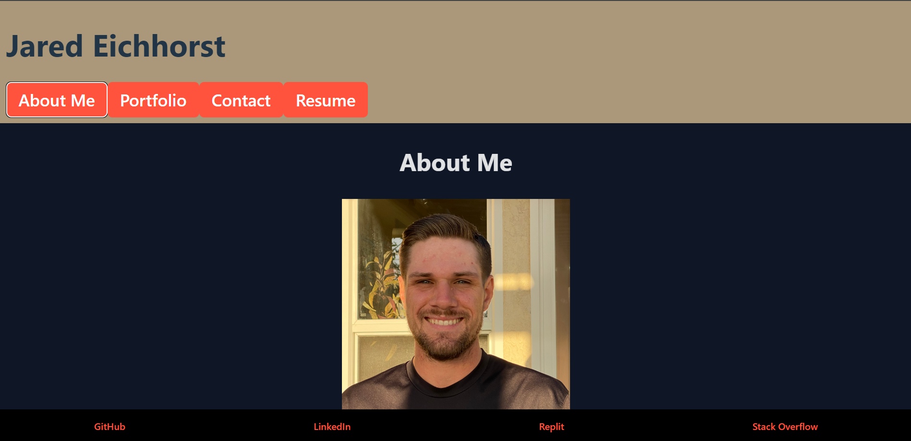

# Personal Portfolio

## Description

This is a personal portfolio project that I made using React. It displays an about me section, my main portfolio with four projects that I have worked on, a contact form, a resume section, and links to my Github, Replit, and LinkedIn at the bottom. The deployed site can be found here: https://jaredeichhorst-portfolio.netlify.app/

## Table of Contents

- [Installation](#installation)
- [Usage](#usage)
- [Image](#image)
- [License](#license)
- [Contributing](#contributing)
- [Tests](#tests)
- [Questions](#questions)

## Installation

N/A

## Usage

This project is intended to be used not only as my main portfolio, but also as a portfolio piece itself, as it shows I have at least a little familiarity with React and using it to create websites.

## Image

## License

This project is licensed under the MIT - see the [LICENSE](https://opensource.org/licenses/MIT) for details.

## Contributing

N/A

## Tests

N/A

## Questions

Got questions? Reach out to me on [GitHub](https://github.com/Jarede712) or by [email](mailto:jaredeichhorst@gmail.com).
